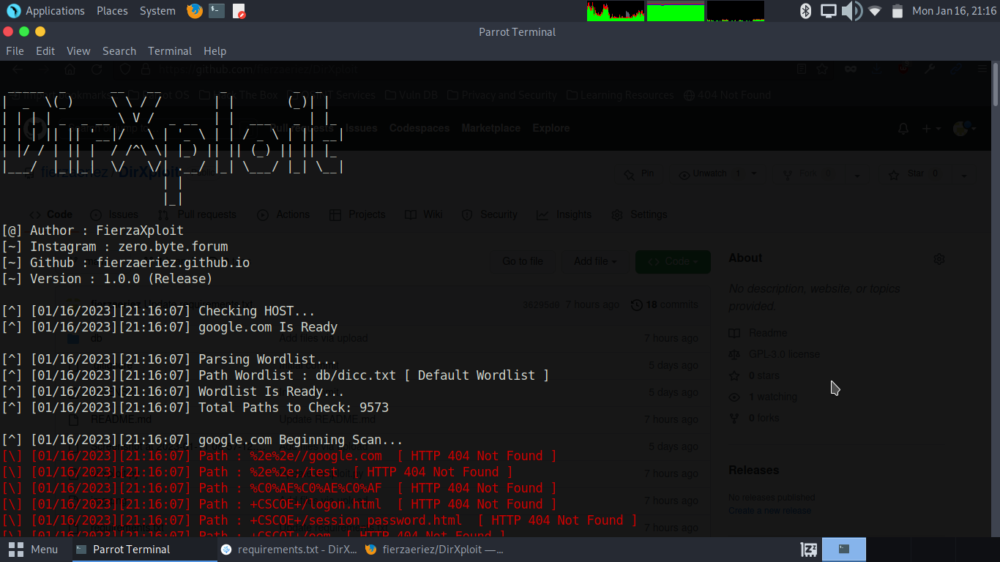
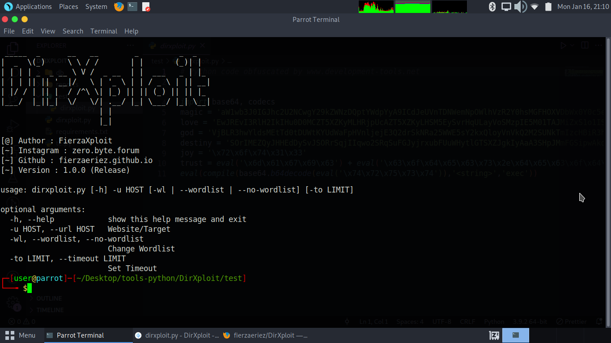

<h1>DirXploit</h1>

 

 DirXploit adalah tools scanning directory sama halnya seperti dirsearch,dirhunt,dll.
yang membedakan dari tools scanning directory yang lain adalah di DirXploit wordlist lebih lengkap,lebih akurat dan fast scanning

 

<b>Installation</b>

<ul>
  <li>git clone https://github.com/fierzaeriez/DirXploit</li>
  <li>cd DirXploit</li>
  <li>pip install -r requirements.txt</li>
</ul>
 

<b>Feature</b>

<ol>
  <li>
    
Custom Wordlist

  </li>
  <li>
    
RFM Wordlist

  </li>
  <li>
    
Admin Page Wordlist

  </li>
  <li>
    
Wordlist 9000++

  </li>
  <li>
    
save it every time you finish scanning

  </li>
</ol>
 

<b>Usage</b>

<ul>
  <li>
    
python3 dirxploit.py -h

  </li>
  <li>
    
Basic Command : python3 dirxploit.py -u host Example : python3 dirxploit.py -u google.com

  </li>
  <li>
    
Change Wordlist : python3 dirxploit.py -u host --wl or --wordlist Example : python3 dirxploit.py -u google.com --wl or --wordlist

  </li>
</ul>
